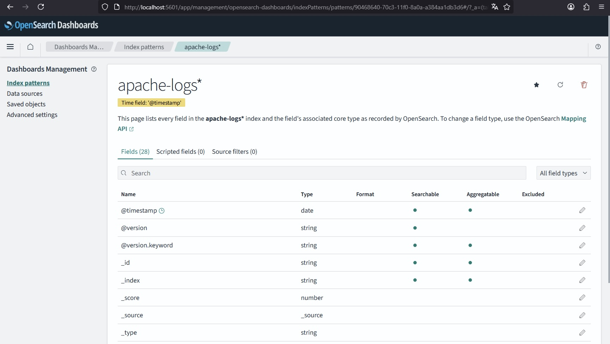
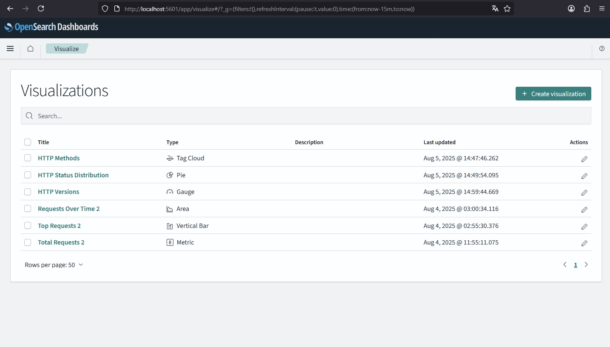
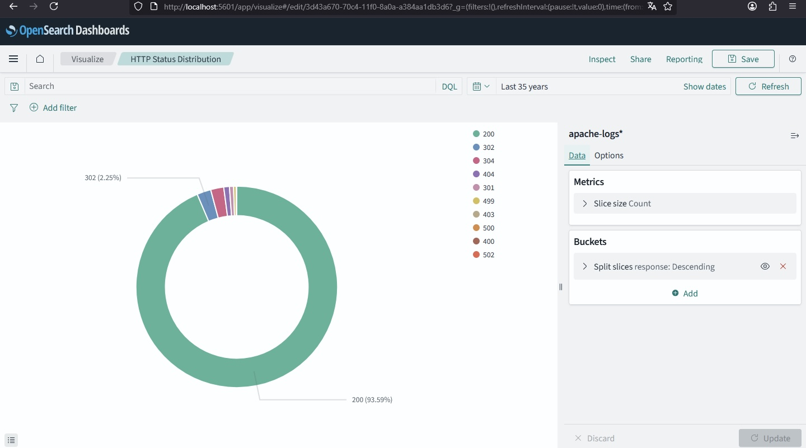
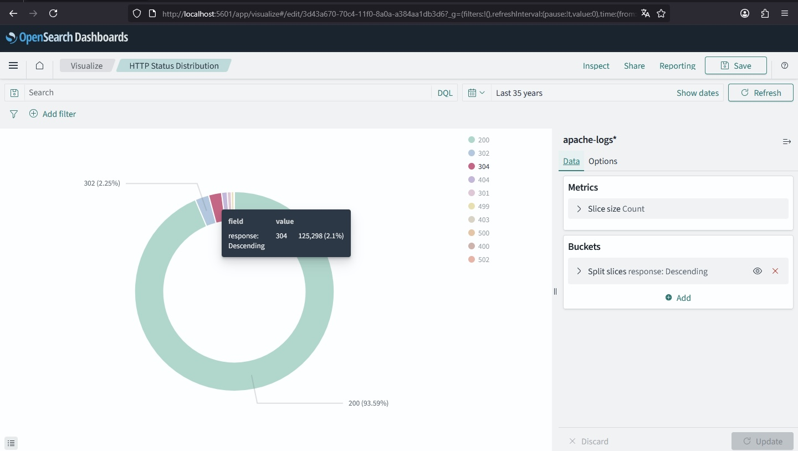
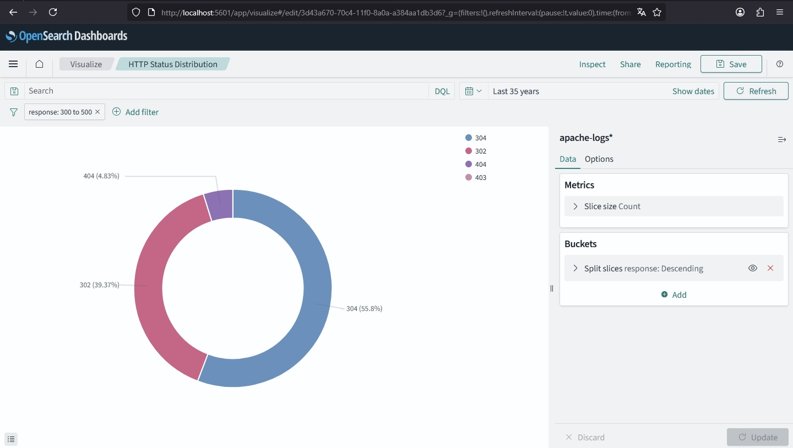
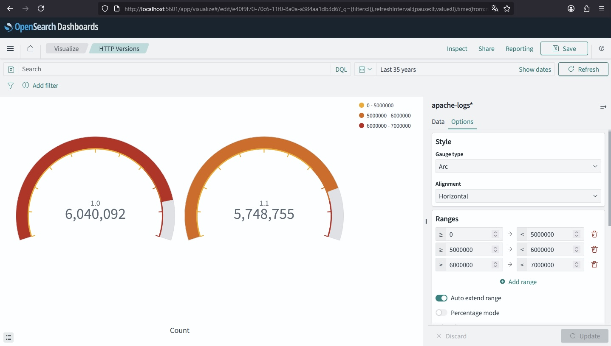
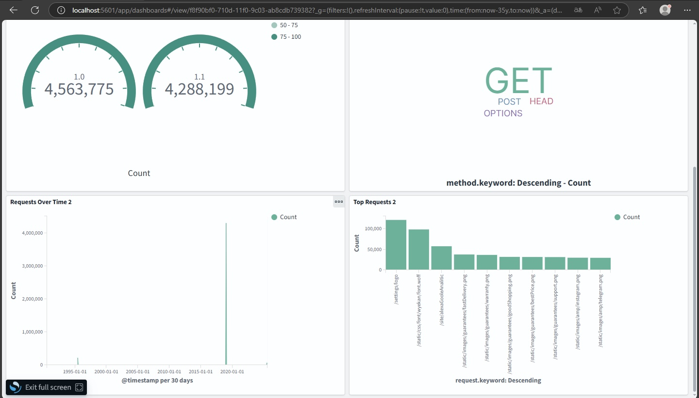

# **Отчет о выполнении тестового задания: Развертывание аналитического кластера OpenSearch**


### **Техническое задание:**  
Разработать и развернуть систему для сбора, обработки и визуализации веб-логов 
с использованием следующих инструментов:  
- OpenSearch;  
- OpenSearch Dashboards;  
- Logstash.
 
## Подготовка  
Для начала выполнения задания было необходимо изучить перечисленные выше инструменты. После ознакомления с официальной документацией OpenSearch, а также со статьями и видеоматериалами я приступил к практической части.
Перед установкой и настройкой в задании было предложено выбрать способ развертывания. Я решил развернуть OpenSearch на виртуальной машине с Linux без использования Docker, но позже решил, что в рамках этого задания хочу познакомиться и разобраться с таким важным и новым для меня инструментом как Docker, следовательно использовал свою Windows 10.

## **Установка и настройка:**  
### 1)	Для начала был установлен Docker Desktop для более наглядного и простого знакомства с программой;  

### 2)	**Установка и настройка OpenSearch:**
   
- загрузка образа OpenSearch:

```powershell
docker pull bitnami/opensearch:latest
```
- создание сети для последующего подключения других контейнеров:   
```powershell
docker network create app-tier --driver bridge
```

- запуск контейнера: 
```powershell
docker run -d \
--name opensearch-server \
-p 9200:9200 \
-p 9300:9300 \
--network app-tier \
-v opensearch_data:/bitnami/opensearch bitnami/opensearch:latest
```
- было необходимо настроить переменные окружения, такие как: opensearch_password, opensearch_cluster_name, opensearch_heap_size, opensearch_enable_security и т.д.  
Пример настройки для opensearch_password: 
```powershell
docker run -d \
  --name opensearch-server \
  -p 9200:9200 \
  -p 9300:9300 \
  --network app-tier \
  -e OPENSEARCH_PASSWORD=mysecurepassword \
  -v opensearch_data:/bitnami/opensearch \
  bitnami/opensearch:latest
```
Итогом настройки OpenSearch было успешное подключение к localhost:9200.

### 3)	**Установка и настройка OpenSearch Dashboards:**
 
- загрузка образа OpenSearch Dashboards: 
```powershell
docker pull bitnami/opensearch-dashboards:latest
```
- важным шагом было запустить OpenSearch Dashboards с подключением к той же сети, которая была создана пунктом выше: 
```powershell
docker run -d --name opensearch-dashboards -p 5601:5601 `
  --network app-tier `
  -e OPENSEARCH_DASHBOARDS_OPENSEARCH_URL=http://opensearch-server:9200 `
  bitnami/opensearch-dashboards:latest
```
после этих команд был успешно запущен localhost:5601.  

 
 ### 4) **Установка, настройка и сбор данных Logstash:**
    
- загрузка образа Logstash:
```powershell
docker pull docker.elastic.co/logstash/logstash:8.12.0
```
- создание следующей структуры папок: 
```powershell
mkdir C:\docker\logstash
mkdir C:\docker\logstash\pipeline
mkdir C:\docker\logstash\data
```
- скачан датасет с Kaggle ***https://www.kaggle.com/datasets/eliasdabbas/web-server-access-logs*** в котором логи соответствуют стандартному формату Apache Common Log Format (CLF), что полностью совмещается с будущим Grok-фильтром; 
- поместил разархивированный access.log в C:\docker\logstash\data\;  
- создал при помощи Notepad++ logstash.conf в C:\docker\logstash\pipeline\. Важными деталями являлось сохранять файл в кодировке UTF-8 без BOM с переносами строк в формате LF (Unix), а не CRLF (Windows);  
- отмечу, что команда **docker logs -f logstash** использовалась чаще остальных при выполнении данного задания, поскольку количество ошибок при конфигурации logstash.conf легко превысило десятки, а может и сотни. Об основных проблемах при настройке logstash.conf будет упомянуто в отдельном пункте;  
- выполнил тестовый запрос к OpenSearch, по итогам которого было найдено более 10,000 записей, создан индекс apache-logs-1995.07.01, а также такие поля как client, method, response, request, bytes, @timestamp корректно распаршены:
  
```powershell
PS C:\Users\Dmitry> curl.exe -XGET "http://localhost:9200/apache-logs-*/_search?pretty" -u admin:admin
```

<details>
<summary>📋 Полный вывод команды (нажмите чтобы развернуть)</summary>

```json
{
  "took" : 106409,
  "timed_out" : false,
  "_shards" : {
    "total" : 2,
    "successful" : 2,
    "skipped" : 0,
    "failed" : 0
  },
  "hits" : {
    "total" : {
      "value" : 10000,
      "relation" : "gte"
    },
    "max_score" : 1.0,
    "hits" : [
      {
        "_index" : "apache-logs-1995.07.01",
        "_id" : "HwU6cJgBiDr79qVeKU8C",
        "_score" : 1.0,
        "_source" : {
          "event" : {
            "original" : "p06.eznets.canton.oh.us - - [01/Jul/1995:00:07:04 -0400] \"GET /shuttle/missions/sts-71/mission-sts-71.html HTTP/1.0\" 200 12040"
          },
          "ident" : "-",
          "auth" : "-",
          "message" : "p06.eznets.canton.oh.us - - [01/Jul/1995:00:07:04 -0400] \"GET /shuttle/missions/sts-71/mission-sts-71.html HTTP/1.0\" 200 12040",
          "bytes" : "12040",
          "@timestamp" : "1995-07-01T04:07:04.000Z",
          "httpversion" : "1.0",
          "response" : "200",
          "method" : "GET",
          "@version" : "1",
          "client" : "p06.eznets.canton.oh.us",
          "log" : {
            "file" : {
              "path" : "/usr/share/logstash/data/access.log"
            }
          },
          "timestamp" : "01/Jul/1995:00:07:04 -0400",
          "host" : {
            "name" : "a738127120e3"
          },
          "request" : "/shuttle/missions/sts-71/mission-sts-71.html"
        }
      },
      {
        "_index" : "apache-logs-1995.07.01",
        "_id" : "IAU6cJgBiDr79qVeKU8C",
        "_score" : 1.0,
        "_source" : {
          "event" : {
            "original" : "waters-gw.starway.net.au - - [01/Jul/1995:00:07:19 -0400] \"GET /shuttle/missions/51-l/images/86HC119.GIF HTTP/1.0\" 200 127775"
          },
          "ident" : "-",
          "auth" : "-",
          "message" : "waters-gw.starway.net.au - - [01/Jul/1995:00:07:19 -0400] \"GET /shuttle/missions/51-l/images/86HC119.GIF HTTP/1.0\" 200 127775",
          "bytes" : "127775",
          "@timestamp" : "1995-07-01T04:07:19.000Z",
          "httpversion" : "1.0",
          "response" : "200",
          "method" : "GET",
          "@version" : "1",
          "client" : "waters-gw.starway.net.au",
          "log" : {
            "file" : {
              "path" : "/usr/share/logstash/data/access.log"
            }
          },
          "timestamp" : "01/Jul/1995:00:07:19 -0400",
          "host" : {
            "name" : "a738127120e3"
          },
          "request" : "/shuttle/missions/51-l/images/86HC119.GIF"
        }
      },
      {
        "_index" : "apache-logs-1995.07.01",
        "_id" : "IQU6cJgBiDr79qVeKU8C",
        "_score" : 1.0,
        "_source" : {
          "event" : {
            "original" : "asp.erinet.com - - [01/Jul/1995:00:07:23 -0400] \"GET /software/winvn/winvn.html HTTP/1.0\" 200 9867"
          },
          "ident" : "-",
          "auth" : "-",
          "message" : "asp.erinet.com - - [01/Jul/1995:00:07:23 -0400] \"GET /software/winvn/winvn.html HTTP/1.0\" 200 9867",
          "bytes" : "9867",
          "@timestamp" : "1995-07-01T04:07:23.000Z",
          "httpversion" : "1.0",
          "response" : "200",
          "method" : "GET",
          "@version" : "1",
          "client" : "asp.erinet.com",
          "log" : {
            "file" : {
              "path" : "/usr/share/logstash/data/access.log"
            }
          },
          "timestamp" : "01/Jul/1995:00:07:23 -0400",
          "host" : {
            "name" : "a738127120e3"
          },
          "request" : "/software/winvn/winvn.html"
        }
      },
      {
        "_index" : "apache-logs-1995.07.01",
        "_id" : "IgU6cJgBiDr79qVeKU8C",
        "_score" : 1.0,
        "_source" : {
          "event" : {
            "original" : "ppp236.iadfw.net - - [01/Jul/1995:00:07:29 -0400] \"GET /images/KSC-logosmall.gif HTTP/1.0\" 200 1204"
          },
          "ident" : "-",
          "auth" : "-",
          "message" : "ppp236.iadfw.net - - [01/Jul/1995:00:07:29 -0400] \"GET /images/KSC-logosmall.gif HTTP/1.0\" 200 1204",
          "bytes" : "1204",
          "@timestamp" : "1995-07-01T04:07:29.000Z",
          "httpversion" : "1.0",
          "response" : "200",
          "method" : "GET",
          "@version" : "1",
          "client" : "ppp236.iadfw.net",
          "log" : {
            "file" : {
              "path" : "/usr/share/logstash/data/access.log"
            }
          },
          "timestamp" : "01/Jul/1995:00:07:29 -0400",
          "host" : {
            "name" : "a738127120e3"
          },
          "request" : "/images/KSC-logosmall.gif"
        }
      },
      {
        "_index" : "apache-logs-1995.07.01",
        "_id" : "IwU6cJgBiDr79qVeKU8C",
        "_score" : 1.0,
        "_source" : {
          "event" : {
            "original" : "ix-sd11-26.ix.netcom.com - - [01/Jul/1995:00:07:34 -0400] \"GET /images/KSC-logosmall.gif HTTP/1.0\" 200 1204"
          },
          "ident" : "-",
          "auth" : "-",
          "message" : "ix-sd11-26.ix.netcom.com - - [01/Jul/1995:00:07:34 -0400] \"GET /images/KSC-logosmall.gif HTTP/1.0\" 200 1204",
          "bytes" : "1204",
          "@timestamp" : "1995-07-01T04:07:34.000Z",
          "httpversion" : "1.0",
          "response" : "200",
          "method" : "GET",
          "@version" : "1",
          "client" : "ix-sd11-26.ix.netcom.com",
          "log" : {
            "file" : {
              "path" : "/usr/share/logstash/data/access.log"
            }
          },
          "timestamp" : "01/Jul/1995:00:07:34 -0400",
          "host" : {
            "name" : "a738127120e3"
          },
          "request" : "/images/KSC-logosmall.gif"
        }
      },
      {
        "_index" : "apache-logs-1995.07.01",
        "_id" : "JAU6cJgBiDr79qVeKU8C",
        "_score" : 1.0,
        "_source" : {
          "event" : {
            "original" : "199.166.39.14 - - [01/Jul/1995:00:07:37 -0400] \"GET /shuttle/missions/sts-71/movies/sts-71-tcdt-crew-walkout.mpg HTTP/1.0\" 200 131072"
          },
          "ident" : "-",
          "auth" : "-",
          "message" : "199.166.39.14 - - [01/Jul/1995:00:07:37 -0400] \"GET /shuttle/missions/sts-71/movies/sts-71-tcdt-crew-walkout.mpg HTTP/1.0\" 200 131072",
          "bytes" : "131072",
          "@timestamp" : "1995-07-01T04:07:37.000Z",
          "httpversion" : "1.0",
          "response" : "200",
          "method" : "GET",
          "@version" : "1",
          "client" : "199.166.39.14",
          "log" : {
            "file" : {
              "path" : "/usr/share/logstash/data/access.log"
            }
          },
          "timestamp" : "01/Jul/1995:00:07:37 -0400",
          "host" : {
            "name" : "a738127120e3"
          },
          "request" : "/shuttle/missions/sts-71/movies/sts-71-tcdt-crew-walkout.mpg"
        }
      },
      {
        "_index" : "apache-logs-1995.07.01",
        "_id" : "JQU6cJgBiDr79qVeKU8C",
        "_score" : 1.0,
        "_source" : {
          "event" : {
            "original" : "ppp4.sunrem.com - - [01/Jul/1995:00:07:43 -0400] \"GET /images/KSC-logosmall.gif HTTP/1.0\" 200 1204"
          },
          "ident" : "-",
          "auth" : "-",
          "message" : "ppp4.sunrem.com - - [01/Jul/1995:00:07:43 -0400] \"GET /images/KSC-logosmall.gif HTTP/1.0\" 200 1204",
          "bytes" : "1204",
          "@timestamp" : "1995-07-01T04:07:43.000Z",
          "httpversion" : "1.0",
          "response" : "200",
          "method" : "GET",
          "@version" : "1",
          "client" : "ppp4.sunrem.com",
          "log" : {
            "file" : {
              "path" : "/usr/share/logstash/data/access.log"
            }
          },
          "timestamp" : "01/Jul/1995:00:07:43 -0400",
          "host" : {
            "name" : "a738127120e3"
          },
          "request" : "/images/KSC-logosmall.gif"
        }
      },
      {
        "_index" : "apache-logs-1995.07.01",
        "_id" : "tAU6cJgBiDr79qVeKE78",
        "_score" : 1.0,
        "_source" : {
          "event" : {
            "original" : "wwwproxy.info.au - - [01/Jul/1995:00:09:39 -0400] \"GET /images/WORLD-logosmall.gif HTTP/1.0\" 304 0"
          },
          "ident" : "-",
          "auth" : "-",
          "message" : "wwwproxy.info.au - - [01/Jul/1995:00:09:39 -0400] \"GET /images/WORLD-logosmall.gif HTTP/1.0\" 304 0",
          "bytes" : "0",
          "@timestamp" : "1995-07-01T04:09:39.000Z",
          "httpversion" : "1.0",
          "response" : "304",
          "method" : "GET",
          "@version" : "1",
          "client" : "wwwproxy.info.au",
          "log" : {
            "file" : {
              "path" : "/usr/share/logstash/data/access.log"
            }
          },
          "timestamp" : "01/Jul/1995:00:09:39 -0400",
          "host" : {
            "name" : "a738127120e3"
          },
          "request" : "/images/WORLD-logosmall.gif"
        }
      },
      {
        "_index" : "apache-logs-1995.07.01",
        "_id" : "JgU6cJgBiDr79qVeKU8C",
        "_score" : 1.0,
        "_source" : {
          "event" : {
            "original" : "dnet018.sat.texas.net - - [01/Jul/1995:00:07:50 -0400] \"GET /images/ksclogo-medium.gif HTTP/1.0\" 200 5866"
          },
          "ident" : "-",
          "auth" : "-",
          "message" : "dnet018.sat.texas.net - - [01/Jul/1995:00:07:50 -0400] \"GET /images/ksclogo-medium.gif HTTP/1.0\" 200 5866",
          "bytes" : "5866",
          "@timestamp" : "1995-07-01T04:07:50.000Z",
          "httpversion" : "1.0",
          "response" : "200",
          "method" : "GET",
          "@version" : "1",
          "client" : "dnet018.sat.texas.net",
          "log" : {
            "file" : {
              "path" : "/usr/share/logstash/data/access.log"
            }
          },
          "timestamp" : "01/Jul/1995:00:07:50 -0400",
          "host" : {
            "name" : "a738127120e3"
          },
          "request" : "/images/ksclogo-medium.gif"
        }
      },
      {
        "_index" : "apache-logs-1995.07.01",
        "_id" : "JwU6cJgBiDr79qVeKU8C",
        "_score" : 1.0,
        "_source" : {
          "event" : {
            "original" : "dnet018.sat.texas.net - - [01/Jul/1995:00:08:00 -0400] \"GET /images/USA-logosmall.gif HTTP/1.0\" 200 234"
          },
          "ident" : "-",
          "auth" : "-",
          "message" : "dnet018.sat.texas.net - - [01/Jul/1995:00:08:00 -0400] \"GET /images/USA-logosmall.gif HTTP/1.0\" 200 234",
          "bytes" : "234",
          "@timestamp" : "1995-07-01T04:08:00.000Z",
          "httpversion" : "1.0",
          "response" : "200",
          "method" : "GET",
          "@version" : "1",
          "client" : "dnet018.sat.texas.net",
          "log" : {
            "file" : {
              "path" : "/usr/share/logstash/data/access.log"
            }
          },
          "timestamp" : "01/Jul/1995:00:08:00 -0400",
          "host" : {
            "name" : "a738127120e3"
          },
          "request" : "/images/USA-logosmall.gif"
        }
      }
    ]
  }
}
```
</details>


## **Проблемы при настройке logstash.conf**  

Этап настройки logstash.conf вызвал небольшие затруднения при интеграции с другими узлами кластера.
Важно было понять структуру построения данного файла и то, как он взаимодействует с другими компонентами кластера, а также основные плагины:  
- File Input Plugin (читает логи из файла);  
- Grok Filter Plugin (разбирает неструктурированные логи в поля, например, дату, IP, ошибку);  
- OpenSearch Output Plugin (отправляет обработанные логи в OpenSearch).  
  
Ошибки были различного типа, например, синтаксического:   
```powershell
[2025-08-02T19:36:42,300][ERROR][logstash.agent ] Failed to execute action {:action=>LogStash::PipelineAction::Create/pipeline_id:main, :exception=>"LogStash::ConfigurationError", :message=>"Expected one of [ \\t\\r\\n], \"#\", \"input\", \"filter\", \"output\" at line 1, column 1 (byte 1)", :backtrace=>["/opt/bitnami/logstash/logstash-core/lib/logstash/compiler.rb:32:in `compile_imperative'", "org/logstash/execution/AbstractPipelineExt.java:285:in `initialize'", "org/logstash/execution/AbstractPipelineExt.java:223:in `initialize'", "/opt/bitnami/logstash/logstash-core/lib/logstash/java_pipeline.rb:47:in `initialize'", "org/jruby/RubyClass.java:950:in `new'", "/opt/bitnami/logstash/logstash-core/lib/logstash/pipeline_action/create.rb:50:in `execute'", "/opt/bitnami/logstash/logstash-core/lib/logstash/agent.rb:431:in `block in converge_state'"]}
```
Logstash ожидает, что конфигурационный файл будет содержать как минимум одну из секций: input, filter, output, как раз в этом логе ошибка Expected one of [ \t\r\n], "#", "input", "filter", "output" говорит, что файл либо пустой, либо содержит недопустимые символы в начале. Решением для подобных ошибок были проверки содержимого файла конфигурации, кодировки UTF-8 без BOM, отсутствия скрытых символов и т.д. 

Были ошибки – конфликты портов, потому что Logstash использует порт 9600 для API, который может конфликтовать с другими сервисами, такимии как Docker Desktop.   
Вот пример такого лога: 
```powershell
[2025-08-02T19:46:01,079][INFO ][logstash.agent ] Successfully started Logstash API endpoint {:port=>9600, :ssl_enabled=>false} [2025-08-02T19:46:01,097][INFO ][logstash.runner ] Logstash shut down. [2025-08-02T19:46:01,109][FATAL][org.logstash.Logstash ] Logstash stopped processing because of an error: (SystemExit) exit
```
Решением этой проблемы стало изменение порта API Logstash.

## **Визуализация данных:**

- в OpenSearch Dashboards был создан Index Pattern для того, чтобы Dashboards знал, где искать логи;  

    <div align="center">
  
  <p><em>Рис. 1 — Index Pattern в OpenSearch Dashboards</em></p>
</div>
  
- создан ряд визуализаций (metric, pie, data table, line, vertical bar);  

<div align="center" style="max-width: 100%;">
  
  <div style="margin: 20px 0;">
    
    <p><em>Рис. 2 — Перечень визуализаций</em></p>
  </div>
  
   <div style="margin: 20px 0;">
    
    <p><em>Рис. 3 — Визуализация HTTP Status Distribution № 1</em></p>
  </div>
  
   <div style="margin: 20px 0;">
    
    <p><em>Рис. 4 — Визуализация HTTP Status Distribution № 2</em></p>
  </div>
</div>

- настроены фильтры для выбора конкретной категории или элемента для анализа (например, так: field - response, operator - is between 300/400);

  <div align="center">
  
  <p><em>Рис. 5 — Применение фильтра к визуализации HHTTP Status Distribution</em></p>
</div>
 
- использована цветовая раскраска для улучшения восприятия;

  <div align="center">
  
  <p><em>Рис. 6 — Применение цветовой раскраски</em></p>
</div>
     
- создан дашборд, в который были добавлены все ранее подготовленные визуализации с настройкой фильтров уже в рамках дашборда.

  <div align="center">
  
  <p><em>Рис. 7 — Пример дашборда № 1 </em></p>
</div>

<div align="center">
  
  <p><em>Рис. 7 — Пример дашборда № 2 </em></p>
</div>

## Вывод  

В ходе тестового задания был успешно развернут аналитический кластер на базе OpenSearch, включающий в себя сбор логов через Logstash и визуализацию в OpenSearch Dashboards. Работа над заданием позволила познакомиться с полезными инструментами, особенно интересным оказался процесс настройки Grok-фильтров в Logstash и создание визуализаций. Наибольшую сложность вызвала отладка конфигурации Logstash, но это ценный опыт для будущих проектов.


  


